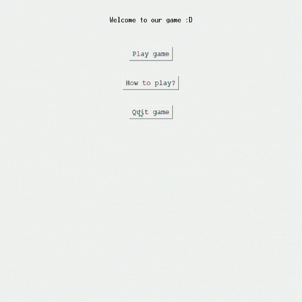

# Vanilla Dance Dance Revolution

(Mini project)

Using Raspberry Pi to recreate the famous Dance Dance Revolution using Tkinter GUI in hopes of providing a fun and simple game.



## Usage

1. Clone the repository

```bash
git clone https://github.com/Roziallegro/Vanilla-Dance-Dance-Revolution.git
```

2. Install the following when using RPI to play the game:

```bash
pip install pillow
pip install RPi.GPIO
```

\*Note that 4 seperate buttons have to be connected to RPI

Else, playing with keyboard is also possible for which only this need to be pip installed:

```bash
pip install pillow
```

3. Run the python code

```bash
python game_for_rpi.py
```

or

```bash
python game_for_keyboard_control.py
```
